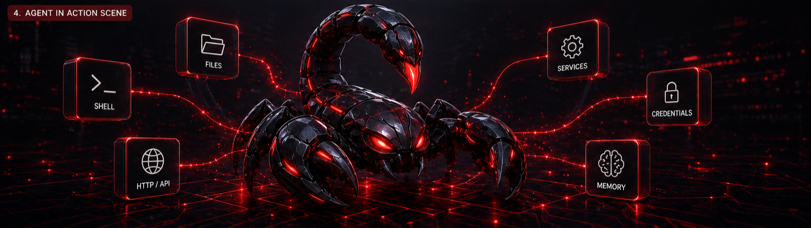

# SynthClaw CoAgent
---



---

```
  /$$$$$$                        /$$     /$$                 /$$                                /$$$$$$                                                      /$$    
 /$$__  $$                      | $$    | $$                | $$                               /$$__  $$                                                    | $$    
| $$  \__/ /$$   /$$ /$$$$$$$  /$$$$$$  | $$$$$$$   /$$$$$$$| $$  /$$$$$$  /$$  /$$  /$$      | $$  \__/  /$$$$$$   /$$$$$$   /$$$$$$   /$$$$$$  /$$$$$$$  /$$$$$$  
|  $$$$$$ | $$  | $$| $$__  $$|_  $$_/  | $$__  $$ /$$_____/| $$ |____  $$| $$ | $$ | $$      | $$       /$$__  $$ |____  $$ /$$__  $$ /$$__  $$| $$__  $$|_  $$_/  
 \____  $$| $$  | $$| $$  \ $$  | $$    | $$  \ $$| $$      | $$  /$$$$$$$| $$ | $$ | $$      | $$      | $$  \ $$  /$$$$$$$| $$  \ $$| $$$$$$$$| $$  \ $$  | $$    
 /$$  \ $$| $$  | $$| $$  | $$  | $$ /$$| $$  | $$| $$      | $$ /$$__  $$| $$ | $$ | $$      | $$    $$| $$  | $$ /$$__  $$ | $$  | $$| $$_____/| $$  | $$  | $$ /$$
|  $$$$$$/|  $$$$$$$| $$  | $$  |  $$$$/| $$  | $$|  $$$$$$$| $$|  $$$$$$$|  $$$$$/$$$$/      |  $$$$$$/|  $$$$$$/|  $$$$$$$|  $$$$$$$|  $$$$$$$| $$  | $$  |  $$$$/
 \______/  \____  $$|__/  |__/   \___/  |__/  |__/ \_______/|__/ \_______/ \_____/\___/        \______/  \______/  \_______/ \____  $$ \_______/|__/  |__/   \___/  
           /$$  | $$                                                                                                         /$$  \ $$                              
          |  $$$$$$/                                                                                                        |  $$$$$$/                              
           \______/                                                                                                          \______/                               
```

**Your personal AI agent that lives on a cheap VPS and talks to you through Telegram or WhatsApp.**

SynthClaw-CoAgent is a lightweight, self-hosted AI agent that runs on a single server. It can execute shell commands, manage files, call APIs, run background services, store encrypted credentials, and remember things across conversations — all controlled through natural chat **or the CLI**.

---

## 🎯 Why SynthClaw?

- 👤 **You want a personal AI assistant**, not an enterprise platform
- ⚡ **You want it running in 5 minutes**, not after configuring 47 TOML files
- 💰 **You want it on a $6/month VPS**, not a Kubernetes cluster
- 📱 **You want to chat with it on Telegram/WhatsApp**, not through a web UI
- 🖥️ **You want full CLI control** — setup, deploy, manage, all with one command
- 📖 **You want to read and understand the entire codebase** in one sitting (~1300 lines of Python)

---

## 🚀 Quick Start (CLI Wizard)

### 1. Clone & Install CLI

```bash
git clone https://github.com/truehannan/synthclaw-coagent.git
cd synthclaw-coagent/cli
npm install && npm run build
npm link
```

After `npm link`, the `synthclaw` command is available globally on your machine.

### 2. Run the Setup Wizard

```bash
synthclaw setup
```

The wizard interactively asks for everything:
- Storage mode (local SQLite or Cloudflare D1 + R2)
- Interface mode (Telegram / WhatsApp / Both)
- Telegram bot token
- WhatsApp API credentials (if applicable)
- LLM provider API key & base URL
- Default model selection
- Server settings (remote host, base directory)

If you've already run setup before, existing values are shown as defaults — press Enter to keep them.

No more manually editing `.env` files. One command handles it all.

### 3. Deploy to Your VPS

```bash
synthclaw deploy
```

This uploads all agent files, writes your `.env`, installs Python dependencies, sets up the systemd service, and starts the agent — all in one step.

### 4. Start Chatting

Open Telegram, find your bot, send `/start`. That's it.

Or use the CLI directly:

```bash
synthclaw agent "deploy a node server on port 3000"
synthclaw run "systemctl status nginx"
synthclaw plan "set up daily backups for /var/www"
```

---

## 🖥️ CLI Commands

After `npm link`, all commands start with `synthclaw`:

### Setup & Lifecycle

| Command | Description |
|---------|-------------|
| `synthclaw setup` | Interactive wizard — configure all credentials & settings |
| `synthclaw deploy` | Deploy agent to your remote VPS (upload + install + start) |
| `synthclaw start` | Start the agent (runs persistently until machine stops) |
| `synthclaw stop` | Stop the running agent |
| `synthclaw status` | Show agent status, model, config |
| `synthclaw logs` | Tail agent logs (`-f` for follow mode) |

### AI & Execution

| Command | Description |
|---------|-------------|
| `synthclaw run <cmd>` | Execute a shell command on the agent server |
| `synthclaw plan <task>` | Break a task into steps (no execution) |
| `synthclaw agent <task>` | Autonomous mode — executes without asking |

### Memory & Credentials

| Command | Description |
|---------|-------------|
| `synthclaw memory` | Show all remembered facts |
| `synthclaw memory set <key> <value>` | Remember a fact |
| `synthclaw memory get <key>` | Recall a specific fact |
| `synthclaw creds` | List stored credentials (values hidden) |
| `synthclaw creds set <name> <value>` | Store an encrypted credential |
| `synthclaw creds get <name>` | Retrieve a credential |

### Model Management

| Command | Description |
|---------|-------------|
| `synthclaw model` | Show current LLM model |
| `synthclaw model <name>` | Switch to a different model |
| `synthclaw models` | List all available models by provider |

### Utility

| Command | Description |
|---------|-------------|
| `synthclaw ping` | Check if the agent is alive |
| `synthclaw clear` | Wipe conversation history |
| `synthclaw help` | Show all commands |

---

## 📲 Telegram Commands

When chatting with your bot on Telegram, these slash commands are available:

| Command | Description |
|---------|-------------|
| `/start` | Register as owner (first user only) |
| `/help` | Show all commands |
| `/clear` | Wipe conversation history |
| `/model [name]` | Show or switch LLM model |
| `/models` | List available models |
| `/status` | Show running systemd services |
| `/creds` | List stored credentials (values hidden) |
| `/memory` | Show all remembered facts |
| `/run <cmd>` | Execute a shell command directly |
| `/plan <task>` | Break a task into steps (no execution) |
| `/agent <task>` | Autonomous mode — executes without asking |
| `/ping` | Check if the agent is alive |
| `/connectors [connect <app>\|search <query>]` | List connected Composio apps, connect a new app via OAuth, or search available tools |
| `/mcp [add <json>\|remove <name>]` | List, add, or remove MCP server configurations |
| `/skills` | List, install (`.zip` or URL), or remove skills |

**Or just chat normally:**
> "What's the best way to set up a cron job?"
>
> "Create a Python script that checks Bitcoin price every hour and logs it"
>
> "Remember my timezone is UTC+5"

---

## ✨ Features

- 💬 **Conversational AI** — Not just a task executor. It chats, explains, has opinions, and knows when to use tools vs just talk.
- 🛠️ **13 Built-in Tools** — Shell commands, file I/O, HTTP requests, systemd services, encrypted credential storage, persistent memory, Composio app actions
- 📲 **Telegram + WhatsApp** — Full bot interfaces for both platforms
- 🖥️ **Full CLI** — Every bot command is also a `synthclaw` CLI command
- 🔌 **Any LLM Backend** — Works with any OpenAI-compatible API (DigitalOcean Gradient AI, OpenAI, Ollama, vLLM, etc.)
- 🔄 **Multi-Model** — Switch between models on the fly
- 🔐 **Encrypted Credentials** — Fernet encryption for stored API keys and passwords
- 🧠 **Persistent Memory** — Key-value store that survives across conversations
- 📋 **Planning Mode** — Breaks tasks into steps without executing
- 🤖 **Agent Mode** — Executes tasks autonomously, chaining tools without confirmation
- 🔒 **Owner Lock** — First user to `/start` becomes the owner; everyone else is blocked
- ⚙️ **One-Command Setup** — `synthclaw setup` wizard generates everything
- 🧩 **Skills System** — Drop in `.zip` skill packs (each with a `SKILL.md`) to extend the agent's behaviour; install via `/skills install <url>` or by sending a `.zip` directly in chat
- 📊 **Live Progress Messages** — Long-running tool chains edit a single "Working…" message in place so you always see real-time step updates
- 🔗 **Composio Integration** — Connect 1000+ apps (Gmail, Slack, GitHub, Notion, and more) via `/connectors`
- 🔌 **MCP Support** — Add Model Context Protocol servers via `/mcp add <json>`
- ☁️ **Cloudflare Storage** — Optionally store agent data in Cloudflare D1 + R2 instead of local SQLite
- ⏱️ **Rate Limiting** — Optional `MAX_RPM` cap to stay within LLM provider limits

---

## 🏗️ Architecture

```
┌──────────────┐     ┌──────────────┐     ┌──────────────┐
│   Telegram   │     │   WhatsApp   │     │  CLI (Node)  │
│   (polling)  │     │  (webhooks)  │     │  synthclaw   │
└──────┬───────┘     └──────┬───────┘     └──────┬───────┘
       │                    │                    │
       └────────────┬───────┘────────────────────┘
                    │
             ┌──────▼──────┐
             │  Agent Core │  ← LLM + tool-call loop
             │  (agent.py) │
             └──────┬──────┘
                    │
        ┌───────────┼───────────┐
        │           │           │
    ┌───▼───┐ ┌────▼────┐ ┌────▼────┐
    │ Tools │ │ Memory  │ │ Config  │
    │13 fns │ │ SQLite  │ │  .env   │
    │       │ │+Fernet  │ │         │
    └───────┘ └─────────┘ └─────────┘
```

**Files:**

| File | Purpose | Lines |
|------|---------|-------|
| `main.py` | Entry point — launches Telegram, WhatsApp, or both | ~40 |
| `agent.py` | Telegram bot + LLM agent loop | ~300 |
| `whatsapp_bot.py` | WhatsApp webhook server (Flask) | ~280 |
| `tools.py` | 13 tool implementations | ~230 |
| `memory.py` | SQLite + Fernet encryption layer | ~170 |
| `config.py` | Environment-based configuration | ~45 |
| `cli/` | Node.js CLI package (`synthclaw` commands) | ~600 |

**Total: ~1900 lines.** You can still read and understand the entire thing.

---

## 💬 WhatsApp Setup

WhatsApp uses the [Meta Cloud API](https://developers.facebook.com/docs/whatsapp/cloud-api/get-started) with webhooks.

The `synthclaw setup` wizard handles all WhatsApp configuration. You just need:

1. A [Meta Developer account](https://developers.facebook.com/)
2. An app with WhatsApp product added
3. Your **Access Token** and **Phone Number ID** from the WhatsApp dashboard

Then run:
```bash
synthclaw setup   # choose "whatsapp" or "both"
synthclaw deploy  # deploys everything to your VPS
```

Set up your webhook URL in Meta dashboard:
- URL: `https://your-domain:8443/webhook`
- Verify token: shown after setup
- Subscribe to `messages`

> **Note:** You need HTTPS for webhooks. Use nginx + Let's Encrypt or Cloudflare Tunnel.

---

## 🧠 LLM Providers

SynthClaw works with any OpenAI-compatible API. Configure via `synthclaw setup` or `synthclaw model`.

| Provider | API Base | Notes |
|----------|----------|-------|
| DigitalOcean Gradient AI | `https://inference.do-ai.run/v1` | Default. Llama 3.3, Mistral, DeepSeek |
| OpenAI | `https://api.openai.com/v1` | GPT-4o, GPT-4-mini |
| Ollama (local) | `http://localhost:11434/v1` | Free, runs on your own hardware |
| Together AI | `https://api.together.xyz/v1` | Llama, Mixtral, many open models |
| Groq | `https://api.groq.com/openai/v1` | Fast inference |
| Any vLLM server | `http://your-server:8000/v1` | Self-hosted |

---

## ⚖️ SynthClaw vs OpenClaw

| | **SynthClaw-CoAgent** | **OpenClaw** |
|---|---|---|
| **Purpose** | Personal assistant for one person | Enterprise agent infrastructure |
| **Language** | Python + Node CLI (~1900 lines) | Node.js (~100K+ lines) |
| **Setup time** | `synthclaw setup` → 2 minutes | Complex (Node.js toolchain, TOML configs) |
| **Server requirements** | $6/mo VPS (1 vCPU, 256MB RAM) | Significant resources |
| **Channels** | Telegram + WhatsApp + CLI | 17+ (Telegram, Discord, Slack, etc.) |
| **Configuration** | Interactive wizard | TOML files, identity system |
| **License** | Source Available (non-commercial) | MIT + Apache-2.0 |
| **Who it's for** | Solo developers, personal use | Teams, orgs, production deployments |

---

## 🔐 Environment Variables

These are configured automatically by `synthclaw setup`. You can also edit `.env` manually:

| Variable | Required | Default | Description |
|----------|----------|---------|-------------|
| `INTERFACE_MODE` | No | `telegram` | `telegram`, `whatsapp`, or `both` |
| `STORAGE_MODE` | No | `local` | `local` (SQLite) or `cloudflare` (D1 + R2) |
| `CF_ACCOUNT_ID` | If `STORAGE_MODE=cloudflare` | — | Cloudflare Account ID |
| `CF_D1_DATABASE_ID` | If `STORAGE_MODE=cloudflare` | — | Cloudflare D1 database ID |
| `CF_API_TOKEN` | If `STORAGE_MODE=cloudflare` | — | Cloudflare API token (D1 + R2 permissions) |
| `CF_R2_BUCKET` | No | — | Cloudflare R2 bucket name (optional file storage) |
| `TELEGRAM_TOKEN` | If using Telegram | — | Bot token from @BotFather |
| `WHATSAPP_TOKEN` | If using WhatsApp | — | Meta Cloud API access token |
| `WHATSAPP_PHONE_NUMBER_ID` | If using WhatsApp | — | Your WhatsApp phone number ID |
| `WHATSAPP_VERIFY_TOKEN` | If using WhatsApp | `synthclaw-verify` | Webhook verification token |
| `WHATSAPP_PORT` | No | `8443` | Webhook server port |
| `OPENAI_API_KEY` | Yes | — | LLM provider API key |
| `OPENAI_API_BASE` | No | `https://inference.do-ai.run/v1` | LLM API base URL |
| `DEFAULT_MODEL` | No | `llama3.3-70b-instruct` | Default model name |
| `SYNTHCLAW_BASE_DIR` | No | `/opt/agent` | Installation directory |
| `MAX_TOOL_ITERATIONS` | No | `10` | Max tool calls per message |
| `MAX_HISTORY_MESSAGES` | No | `20` | Conversation history length |
| `MAX_RPM` | No | `0` (unlimited) | Max LLM requests per minute (0 = unlimited) |
| `COMPOSIO_API_KEY` | No | — | Composio API key for 1000+ app integrations |

---

## 🔧 Built-in Tools

The agent has 13 tools it can use autonomously:

| Tool | What it does |
|------|-------------|
| `run_command` | Execute shell commands |
| `write_file` | Create or overwrite files |
| `read_file` | Read file contents |
| `list_files` | List directory contents |
| `http_request` | Make HTTP requests (GET/POST/PUT/DELETE) |
| `spawn_service` | Create and start a systemd service |
| `stop_service` | Stop a running service |
| `service_status` | Check service status |
| `store_cred` | Store an encrypted credential |
| `get_cred` | Retrieve a stored credential |
| `remember` | Save a persistent fact |
| `recall` | Retrieve saved facts |
| `composio_execute` | Execute any Composio tool action (Gmail, Slack, GitHub, Notion, and 1000+ more) |

---

## 🔗 Composio Integration

[Composio](https://app.composio.dev) gives the agent access to 1000+ app integrations. Once configured, the agent can send emails, create GitHub issues, post Slack messages, update Notion pages, and much more — all from natural chat.

**Setup:**

1. Get your API key at [app.composio.dev](https://app.composio.dev)
2. Add it during `synthclaw setup`, or store it directly:
   ```
   /storekey COMPOSIO_API_KEY <your-key>
   ```
3. Connect apps via Telegram:
   ```
   /connectors connect github
   /connectors connect gmail
   ```
4. The agent can now use those apps autonomously via the `composio_execute` tool.

**Telegram commands:**

| Command | Description |
|---------|-------------|
| `/connectors` | List all connected apps |
| `/connectors connect <app>` | Connect a new app via OAuth |
| `/connectors search <query>` | Search available Composio tools |

---

## 🔌 MCP Support

SynthClaw supports [Model Context Protocol (MCP)](https://modelcontextprotocol.io) servers, letting you plug in any MCP-compatible tool server.

Add a server by pasting its JSON config in Telegram:

```
/mcp add {"mcpServers":{"my-server":{"command":"npx","args":["-y","@my/mcp-server"]}}}
```

| Command | Description |
|---------|-------------|
| `/mcp` | List configured MCP servers |
| `/mcp add <json>` | Add a new MCP server from its JSON config |
| `/mcp remove <name>` | Remove a configured MCP server |

Supports `stdio`, `sse`, and `streamable-http` transports.

---

## 📃 License

This project is released under a **Source Available — Non-Commercial** license.

You are free to use, modify, and share this code for personal and non-commercial purposes. Commercial use requires written permission from the author.

See [LICENSE](LICENSE) for full terms.

---

## 🤝 Contributing

Found a bug? Want to add a feature? PRs are welcome.

Just keep it simple — SynthClaw's entire point is being small and readable.

---

**Made by [@truehannan](https://github.com/truehannan)**
